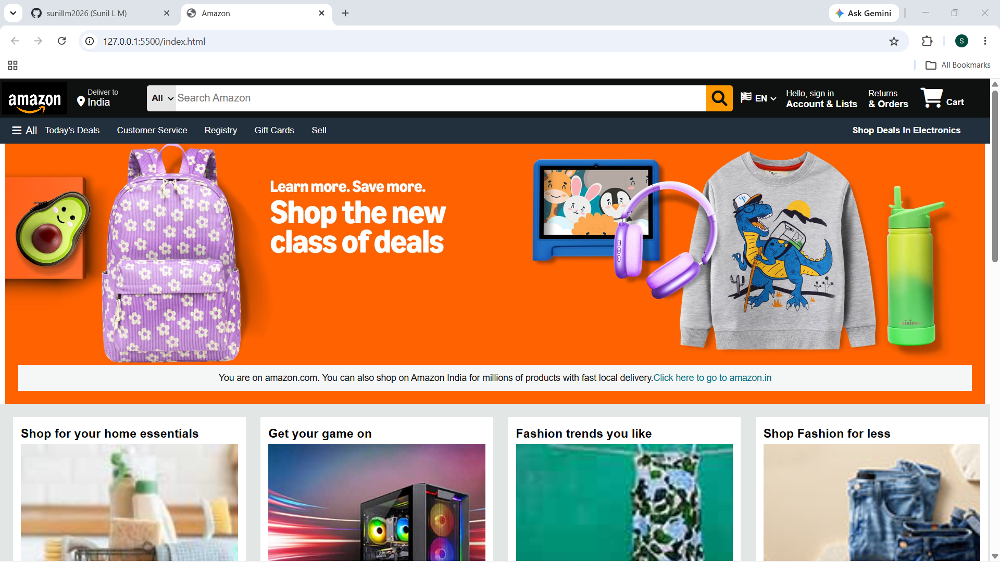
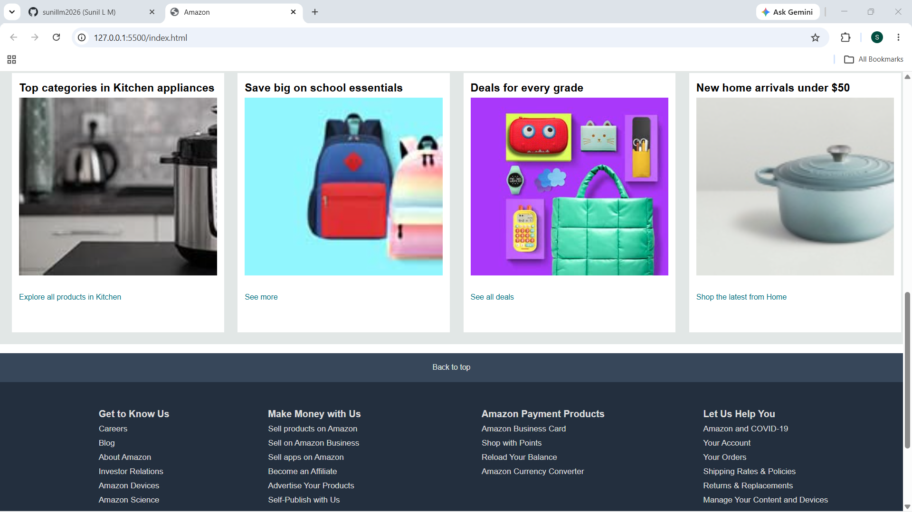

# 🛒 Amazon Homepage Clone

> Recreating one of the world's most visited e-commerce interfaces — pixel by pixel, line by line.

(screenshot2.png)

---

## 🚀 Why I Built This

When I started learning HTML & CSS, I didn't want to build another basic portfolio card.  
I wanted a **real challenge** — something that would push me to understand layouts, spacing, and structure at a professional level.

So I picked Amazon. One of the most complex UIs a beginner can attempt.

---

## 🔧 Built With


- Semantic HTML5 structure  
- CSS Flexbox for navbar and product rows  
- CSS Grid for product card layouts  
- Hover effects and transitions  
- Fully static — no frameworks, no shortcuts

---

## ✨ Features

- 🔝 Sticky navigation bar with search box
- 🖼️ Hero banner section
- 📦 Product cards with hover effects
- 🔗 Category sections layout
- 📄 Multi-column footer

---

## 📸 Preview


---

## 🧠 What I Learned

This project taught me more than any tutorial ever could:

- How to **break down complex UI** into small, manageable components
- The difference between `flexbox` and `grid` — and when to use which
- Why **spacing and alignment** matter more than colors
- How to **replicate a real-world design** without copying code
- The value of writing **clean, readable HTML structure**

---

## 📂 Project Structure

amazon-clone/

├── index.html       → Main page structure

├── style.css        → All styling

└── screenshot.png   → Project preview

---

## 🛠️ How to Run

No installations. No setup. Just:

1. Clone the repo
```bash
git clone https://github.com/sunillm2026/amazon-clone.git
```
2. Open `index.html` in your browser
3. That's it ✅

---

## 🙋‍♂️ About Me

I'm a fresher SDE actively building real projects to break into the industry.  
This is one of many — more coming soon.

📬 Connect with me on [LinkedIn](https://www.linkedin.com/in/sunillm00)  
💻 More projects at [github.com/sunillm2026](https://github.com/sunillm2026)

---

⭐ If this helped you or inspired you, drop a star. It means a lot.
